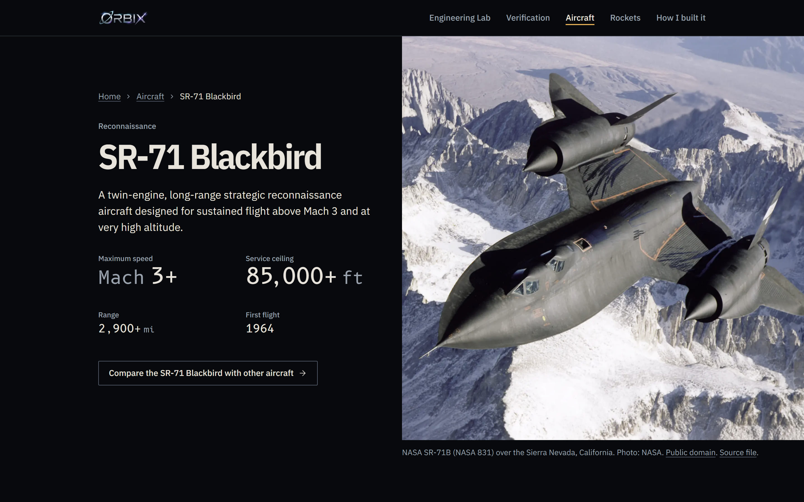
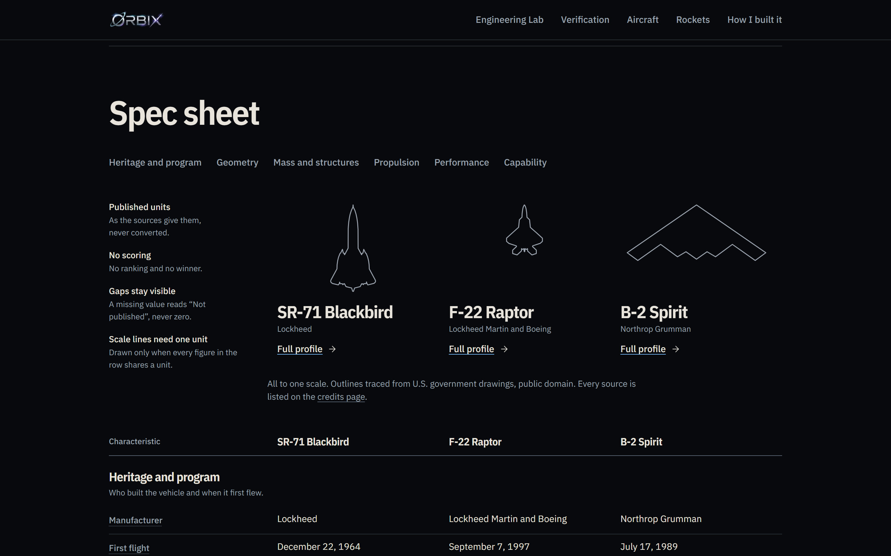
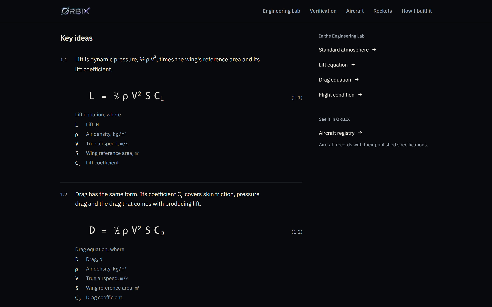
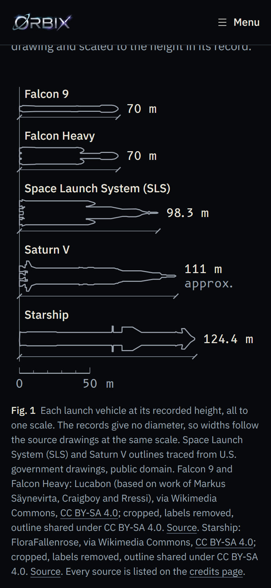
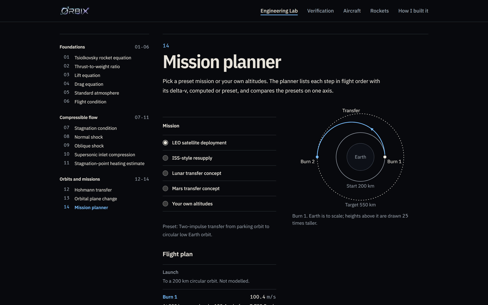
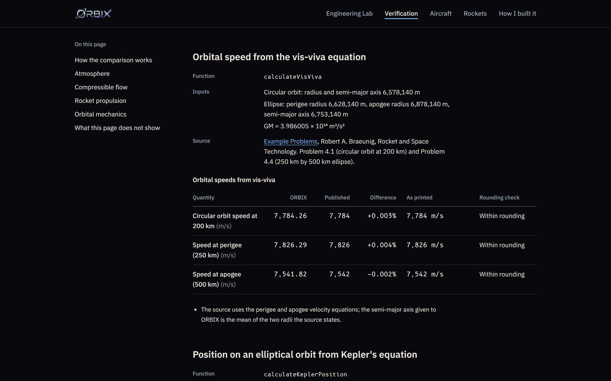

# ORBIX

An educational website about aircraft, launch vehicles and the engineering behind them.

**Live site:** [orbix-aerospace.vercel.app](https://orbix-aerospace.vercel.app)

**Created by Deep Patel**, a high school senior who plans to study aerospace engineering. Read
[how I built ORBIX](https://orbix-aerospace.vercel.app/build-log).

The Engineering Lab has 13 calculators, from the rocket equation and the lift equation to shock
waves and orbital transfers, plus a mission planner. Each calculator shows its equation, units and
assumptions. The Transfer Explorer on the home page draws a Hohmann transfer and updates its
delta-v as you move the target orbit. A verification page runs the lab's own functions on published
worked examples and tables: 26 of the 36 compared values fall within the published rounding, and
the page gives a reason for each of the other 10. ORBIX also has sourced records of 10 U.S.
vehicles (5 military aircraft and 5 launch vehicles), with credited photographs.


## Features

- **Engineering Lab:** 14 tools in three groups (foundations, compressible flow, and orbits and
  missions): 13 calculators and a mission planner.
- **Transfer Explorer:** a Hohmann transfer drawn with Earth to scale. Drag the target orbit or use
  the slider (160 km to 400,000 km, with stops at the ISS, GEO and the Moon) and the burns, total
  delta-v and transfer time update. A play button moves the craft along the transfer; with reduced
  motion it moves in three steps instead. A table gives the same numbers as text.
- **Mission planner:** pick one of four preset missions or enter your own altitudes. It lists each
  step in flight order with its delta-v, marks the steps it does not model, and compares the presets
  on one delta-v axis. The Mars preset uses allowances and is labelled as not computed.
- **Verification:** Engineering Lab results next to values from four published sources, including
  the U.S. Standard Atmosphere, 1976 and the compressible flow tables of NACA Report 1135, with a
  rounding check on each row.
- **Aircraft and launch vehicle records:** F-22 Raptor, F-35 Lightning II, SR-71 Blackbird, B-2
  Spirit and F-15 Eagle; Falcon 9, Falcon Heavy, Saturn V, Space Launch System and Starship.
  Values are kept in their published units, with qualifiers such as "approximate" beside them. Each
  profile has a credited photograph at the top and two or three more views further down.
- **Compare:** two or three vehicles of the same kind in one table, with outlines drawn to one scale.
  It opens on the SR-71, F-22 and B-2. It does not score vehicles or pick a winner, and a value
  missing from the dataset reads "Not published" instead of zero.
- **Learn:** four reading pathways on the engineering behind the calculators, each linked to the
  tools that apply it and to published references.

## Screenshots

| SR-71 Blackbird profile                                                                                                                                                                                                                   | Three aircraft compared                                                                                                                                                                                                                        |
| ----------------------------------------------------------------------------------------------------------------------------------------------------------------------------------------------------------------------------------------- | ---------------------------------------------------------------------------------------------------------------------------------------------------------------------------------------------------------------------------------------------- |
|  |  |

| Launch vehicle registry                                                                                                                                                                                                                                                                                       | Learn: numbered equations                                                                                                                                                                             | Heights to one scale on a phone                                                                                                                                                                                                                                          |
| ------------------------------------------------------------------------------------------------------------------------------------------------------------------------------------------------------------------------------------------------------------------------------------------------------------- | ----------------------------------------------------------------------------------------------------------------------------------------------------------------------------------------------------- | ------------------------------------------------------------------------------------------------------------------------------------------------------------------------------------------------------------------------------------------------------------------------ |
|  |  |  |

| Mission planner                                                                                                                                                                                                                                                                                | Verification against published values                                                                                                                                                            |
| ---------------------------------------------------------------------------------------------------------------------------------------------------------------------------------------------------------------------------------------------------------------------------------------------- | ------------------------------------------------------------------------------------------------------------------------------------------------------------------------------------------------ |
|  |  |

Capture details are in [`docs/assets/screenshots/README.md`](docs/assets/screenshots/README.md).

## How the engineering is checked

The [verification page](https://orbix-aerospace.vercel.app/verification) calls the same functions
the Engineering Lab uses, with the inputs of a published table or worked example, and prints the
ORBIX result beside the published value. It shows the percentage difference and whether ORBIX is
within the rounding of the printed figure. Rows that fall outside are left as they are, with a note
explaining the reason where it is known. Every calculator module also has its own unit tests.

## My role and use of AI

ORBIX was my idea. I chose what it should contain, researched the vehicle specifications and the
engineering behind every tool, and made the design and content decisions. I am an aspiring
aerospace engineer, not a software engineer, so I used AI coding assistants to write the software
under my direction: Codex by OpenAI for the first version, then Claude Code by Anthropic. Commits
made with Claude Code are marked as co-authored by it in the git history. The full account is on
the [build log](https://orbix-aerospace.vercel.app/build-log).

## Tech stack

- Next.js 16 (App Router), React 19, TypeScript 5
- Tailwind CSS 4, Lucide icons
- Vitest for unit tests, Playwright for browser tests
- ESLint and Prettier
- GitHub Actions, hosted on Vercel

Diagrams and visualisations use SVG, CSS and React state. There is no 3D or charting library.

### Architecture

The equations are kept separate from the interface:

- `src/features/engineering-lab/calculators`: pure TypeScript functions, one equation each, with
  SI units and input validation.
- `src/features/engineering-lab/analysis`: studies that combine calculators, such as a delta-v
  budget or a Hohmann transfer.
- `src/features/engineering-lab/materials` and `missions`: typed data and transformations.
- `src/features/orbits`: the Transfer Explorer's drawing, scale mapping and playback, also used by
  the mission planner. The physics stays in the calculators.
- `src/features/engineering-lab/components`: React components that collect inputs and display
  results. They do not contain equations.
- `src/features/vehicles`: vehicle types and data.
- `src/app`: App Router pages and metadata.

React Server Components are the default; client components are used only for interactive forms and
presentation state. See the [architecture guide](docs/architecture.md) and the build log's
[layer diagram](https://orbix-aerospace.vercel.app/build-log#structure).

## Running locally

Requirements: Node.js 20.9 or newer (CI uses Node.js 22) and npm (bundled with Node.js).

```bash
git clone https://github.com/deeppatel4000-pixel/orbix-aerospace.git
cd orbix-aerospace
npm install
npm run dev
```

Open [http://localhost:3000](http://localhost:3000). ORBIX needs no environment variables, accounts
or API keys.

Production build:

```bash
npm run build
npm start
```

## Tests

```bash
npm test               # unit and component tests (Vitest)
npm run lint
npm run typecheck
npm run format:check
npm run validate       # all of the above, the design check and a production build
```

GitHub Actions runs `npm run validate` on pull requests and on pushes to `main`. A separate
Playwright suite (`npm run test:e2e`) covers behaviour that needs a real browser; see
[`docs/testing/browser-testing.md`](docs/testing/browser-testing.md).

## Educational use

ORBIX uses simplified, textbook-level models for learning. It is not intended for operational
mission planning, flight certification or any safety-critical engineering decision, and its results
should not be relied on for those purposes. Vehicle figures come from published public sources and
may be approximate or out of date.

## Privacy

The site has no sign-up and no analytics code, sets no cookies and stores nothing in your browser.
The hosting provider may keep standard request logs.

## Contributing

See [CONTRIBUTING.md](CONTRIBUTING.md) for setup, architecture rules, licensing of contributions,
and image rules.

## Legal

- The source code is available under the [MIT License](LICENSE).
- [NOTICE.md](NOTICE.md) explains what the MIT License does not cover: third-party images, fonts
  and libraries, the ORBIX name and logo, and third-party trademarks.
- Images are credited to their authors and used under the licences recorded in
  [`docs/assets/image-provenance.md`](docs/assets/image-provenance.md) and on the site's `/credits`
  page.
- ORBIX is not affiliated with or endorsed by NASA, the U.S. Department of Defense, or any
  manufacturer or organisation named in it.

## Contact

Deep Patel: deep.patel4000@gmail.com
