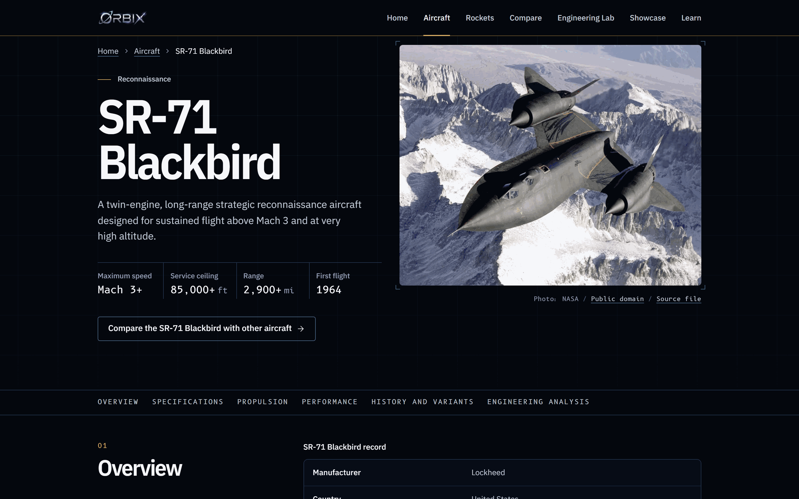
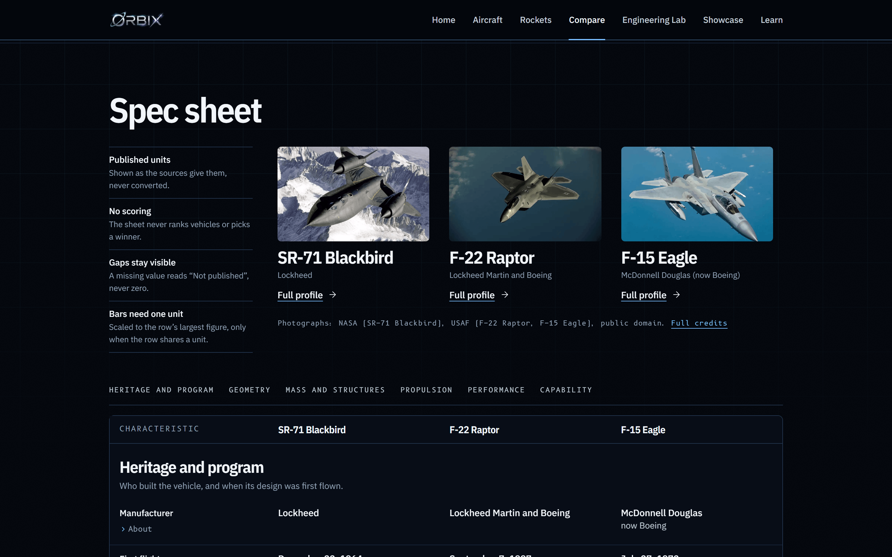
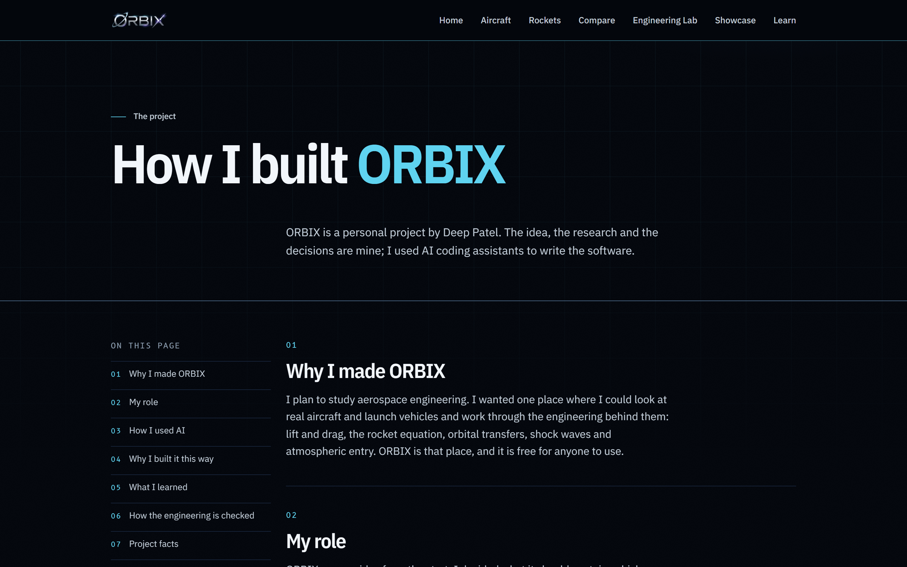
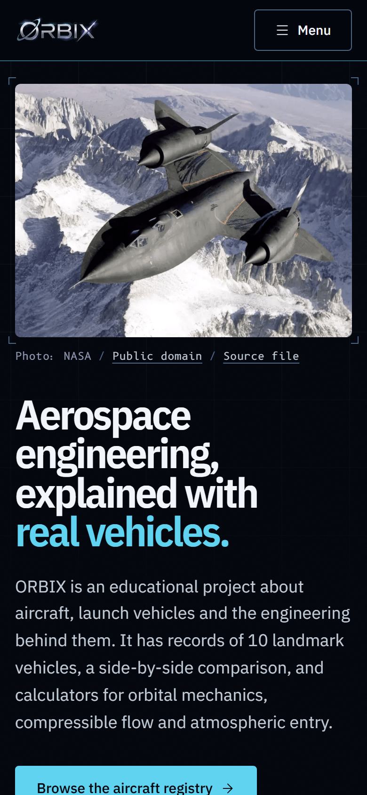
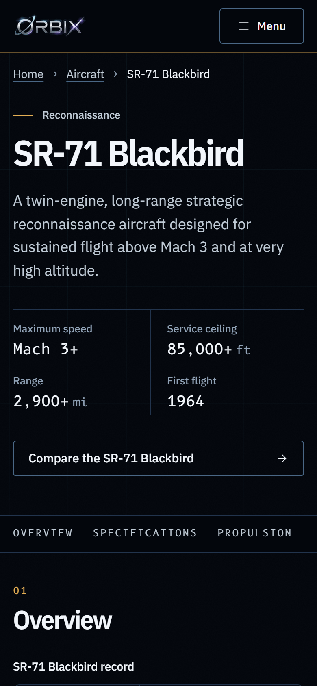
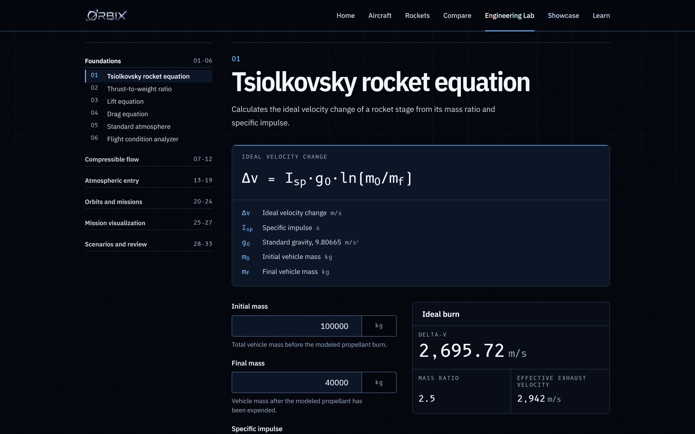
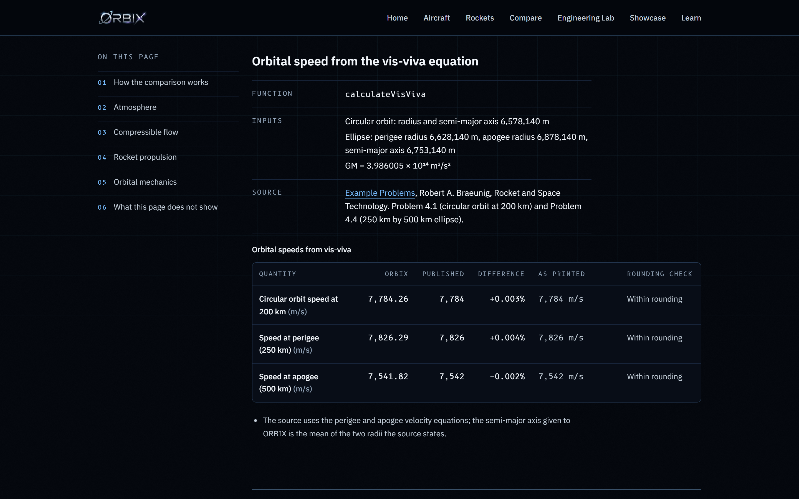

# ORBIX

An educational website about aircraft, launch vehicles and the engineering behind them.

**Live site:** [orbix-aerospace.vercel.app](https://orbix-aerospace.vercel.app)

**Created by Deep Patel.** Read [how I built ORBIX](https://orbix-aerospace.vercel.app/build-log).

ORBIX has sourced records of 10 U.S. vehicles (5 military aircraft and 5 launch vehicles), each
with a credited photograph. You can compare up to three aircraft, or up to three launch vehicles,
side by side. The Engineering Lab has 33 modules, from the rocket equation and the lift equation to
shock waves, atmospheric entry heating and orbital transfers. The calculators show their equation,
inputs and units, and the analyzers state their assumptions. A verification page runs the same calculations against published textbook
and reference values and shows every difference.


## Features

- **Aircraft and launch vehicle records:** F-22 Raptor, F-35 Lightning II, SR-71 Blackbird, B-2
  Spirit and F-15 Eagle; Falcon 9, Falcon Heavy, Saturn V, Space Launch System and Starship.
  Values are kept in their published units, with qualifiers such as "approximate" beside them.
- **Compare:** two or three vehicles of the same kind in one table. It does not score vehicles or
  pick a winner, and a value missing from the dataset reads "Not published" instead of zero.
- **Engineering Lab:** 33 modules in six groups: foundations, compressible flow, atmospheric entry,
  orbits and missions, mission visualization, and scenarios and review.
- **Verification:** Engineering Lab results next to values from published sources such as the U.S.
  Standard Atmosphere, 1976 and the compressible flow tables of NACA Report 1135, with a rounding check on each row.
- **Learn:** six reading pathways on the engineering behind the calculators, each linked to the tools
  that apply it and to published references.
- **Scenario library:** preset mission scenarios, plus custom scenarios saved in your own browser.

## Screenshots

| SR-71 Blackbird profile                                                                                                                                                                                                                            | Three aircraft compared                                                                                                                                                                          |
| -------------------------------------------------------------------------------------------------------------------------------------------------------------------------------------------------------------------------------------------------- | ------------------------------------------------------------------------------------------------------------------------------------------------------------------------------------------------ |
|  |  |

| How I built ORBIX                                                                                                | Home on a phone                                                                               | SR-71 profile on a phone                                                                                                                                                       |
| ---------------------------------------------------------------------------------------------------------------- | --------------------------------------------------------------------------------------------- | ------------------------------------------------------------------------------------------------------------------------------------------------------------------------------ |
|  |  |  |

| Rocket equation calculator                                                                                                                                                                                | Verification against published values                                                                                                                                                            |
| --------------------------------------------------------------------------------------------------------------------------------------------------------------------------------------------------------- | ------------------------------------------------------------------------------------------------------------------------------------------------------------------------------------------------ |
|  |  |

Capture details are in [`docs/assets/screenshots/README.md`](docs/assets/screenshots/README.md).

## How the engineering is checked

The [verification page](https://orbix-aerospace.vercel.app/verification) calls the same functions
the Engineering Lab uses, with the inputs of a published table or worked example, and prints the
ORBIX result beside the published value. It shows the percentage difference and whether ORBIX is
within the rounding of the printed figure. Rows that fall outside are left as they are, with a note
explaining the reason where it is known. Every calculator module also has its own unit tests.

## My role and use of AI

ORBIX was my idea. I chose what it should contain, researched the vehicle specifications and the
engineering behind every tool, and made the design and content decisions. I am an aspiring
aerospace engineer, not a software engineer, so I used AI coding assistants to write the software
under my direction: Codex by OpenAI for the first version, then Claude Code by Anthropic. Commits
made with Claude Code are marked as co-authored by it in the git history. The full account is on
the [build log](https://orbix-aerospace.vercel.app/build-log).

## Tech stack

- Next.js 16 (App Router), React 19, TypeScript 5
- Tailwind CSS 4, Lucide icons
- Vitest for unit tests, Playwright for browser tests
- ESLint and Prettier
- GitHub Actions, hosted on Vercel

Diagrams and visualisations use SVG, CSS and React state. There is no 3D or charting library.

### Architecture

The equations are kept separate from the interface:

- `src/features/engineering-lab/calculators`: pure TypeScript functions, one equation each, with
  SI units and input validation.
- `src/features/engineering-lab/analysis`: studies that combine calculators, such as a delta-v
  budget or a vehicle reentry evaluation.
- `src/features/engineering-lab/materials`, `missions` and `reports`: typed data and
  transformations. The report module can serialise a mission report to JSON or Markdown.
- `src/features/engineering-lab/components`: React components that collect inputs and display
  results. They do not contain equations.
- `src/features/vehicles`: vehicle types and data.
- `src/app`: App Router pages and metadata.

React Server Components are the default; client components are used only for interactive forms and
presentation state. See the [architecture guide](docs/architecture.md) and the site's
[project notes](https://orbix-aerospace.vercel.app/showcase).

## Running locally

Requirements: Node.js 20.9 or newer (CI uses Node.js 22) and npm (bundled with Node.js).

```bash
git clone https://github.com/deeppatel4000-pixel/orbix-aerospace.git
cd orbix-aerospace
npm install
npm run dev
```

Open [http://localhost:3000](http://localhost:3000). ORBIX needs no environment variables, accounts
or API keys.

Production build:

```bash
npm run build
npm start
```

## Tests

```bash
npm test               # unit and component tests (Vitest)
npm run lint
npm run typecheck
npm run format:check
npm run validate       # all of the above, the design check and a production build
```

GitHub Actions runs `npm run validate` on pull requests and on pushes to `main`. A separate
Playwright suite (`npm run test:e2e`) covers behaviour that needs a real browser; see
[`docs/testing/browser-testing.md`](docs/testing/browser-testing.md).

## Educational use

ORBIX uses simplified, textbook-level models for learning. It is not intended for operational
mission planning, flight certification or any safety-critical engineering decision, and its results
should not be relied on for those purposes. Vehicle figures come from published public sources and
may be approximate or out of date.

## Privacy

The site has no sign-up and no analytics code. Custom scenarios saved in the scenario library stay
in your browser's local storage and are not sent to a server. The hosting provider may keep
standard request logs.

## Contributing

See [CONTRIBUTING.md](CONTRIBUTING.md) for setup, architecture rules, licensing of contributions,
and image rules.

## Legal

- The source code is available under the [MIT License](LICENSE).
- [NOTICE.md](NOTICE.md) explains what the MIT License does not cover: third-party images, fonts
  and libraries, the ORBIX name and logo, and third-party trademarks.
- Images are credited to their authors and used under the licences recorded in
  [`docs/assets/image-provenance.md`](docs/assets/image-provenance.md) and on the site's `/credits`
  page.
- ORBIX is not affiliated with or endorsed by NASA, the U.S. Department of Defense, or any
  manufacturer or organisation named in it.

## Contact

Deep Patel: deep.patel4000@gmail.com
